# Sales Release Readiness Browser QA

**System:** JVD Tour Management System  
**Environment:** Local test site (`localhost:3000`, Laravel API on port 8000, PostgreSQL)  
**Test window:** August 25-26, 2026 (Asia/Singapore)  
**Coverage:** Sales Overview, Fixed Packages, Joiner Departures, Bus Charters, Educational Tours, Custom Transactions, Accounting Transactions, and Collections  
**Method:** Staff-operated browser workflows with authorized test financial transactions and downstream accounting checks

## Release verdict

**NOT RELEASE-READY.**

The Educational Tour seat reassignment regression is fixed, and the Custom Transaction path can create a valid paid invoice and collection. However, three core sales engines still cannot complete checkout, and Educational Tour exports fail or provide no observable result. The highest-risk problem is Joiner checkout: even a newly created seat hold is rejected as inactive, so a legitimate sale cannot be completed.

> **Continuation correction (August 26):** Accounting Invoice, Contract, and Statement of Account actions were later confirmed to open generated `blob:` document tabs. The initial audit checked only managed tabs before those user-owned tabs appeared, so those actions are corrected from “failed” to “passed with delayed/unclear feedback.” The Educational manifest/Excel failures and invoice-email backend error remain confirmed.

### Release blockers

1. **Joiner checkout rejects fresh seat holds.** Two attempts failed with `This seat hold is no longer active`, including one submitted immediately after selecting a seat.
2. **Fixed Package checkout cannot pass travel-date validation in the tested browser workflow.** The departure value clears on the next state update, the return field remains read-only/blank, and the cart stops at `Set the tour start and end dates.`
3. **Bus Charter route computation cannot produce a usable route/rate.** Known addresses do not resolve reliably, map pinning returns incorrect coordinates, and fuel/toll/rate values remain zero.
4. **Educational document delivery is unreliable.** Manifest/Excel exports produce no file, view, success message, or actionable error.
5. **Custom checkout reports an ambiguous contract failure.** Checkout says no contract was generated while Accounting shows `Issued` and `CTR-2026-0001`; retrying Contract from Transaction Details successfully opens the document.
6. **Invoice email fails with a backend model error.** Error reference `ERR-EM46YBGOPD`; Laravel reports `Call to undefined relationship [payments] on model [App\Models\Invoice]`.

## End-to-end workflow results

| # | Sales area | Creation/configuration | Autocalculations | Checkout/payment | Documents | Result |
|---|---|---|---|---|---|---|
| 1 | Sales Overview | Loaded service desk and active Joiner run | Seat availability reconciled to 8 open | N/A | N/A | **Partial pass** — slow data hydration (about 18 seconds) |
| 2 | Fixed Packages | QA package saved successfully | Route, fuel, adult/child totals worked | Blocked by date state/validation; no fleet handoff | Not reachable | **Blocked** |
| 3 | Joiner Departures | QA product saved; existing published departure used | Adult/child, VAT, and total worked | Fresh and expired holds both rejected | Not reachable | **Blocked** |
| 4 | Bus Charters | Rate-plan builder opened | Address/geocode/route/fuel/toll calculation failed | Rate plan could not be saved | Not reachable | **Blocked** |
| 5 | Educational Tours | Existing school package, participant, payment, bus, and driver reconciled | Per-head price, collection, capacity, and free seats correct | Paid individual booking is present | Manifest PDF and Excel export failed silently | **Partial pass** |
| 6 | Custom Transactions | Scoped arrangement and deliverable saved into cart | Margin, VAT, total, received, and change correct | Paid checkout succeeded after about 60-70 seconds | Invoice, Contract, and SOA open; invoice email fails | **Partial pass** |
| 7 | Accounting handoff | Custom and Educational records present | Totals and balances reconcile | Paid collection exists with posted payment | Blob documents open after a delay; checkout contract message is inconsistent | **Partial pass** |

## Detailed findings

### P0 — Joiner sales cannot complete

**Reproduction**

1. Open published departure `JTSW-2027-06-18`.
2. Select a free seat and enter participant details.
3. Confirm the calculated amount.
4. Complete the transaction immediately.

**Observed**

- Seat selection itself works and creates the passenger row.
- One adult plus one child calculated correctly: `₱3,500 + ₱2,450 + ₱714 VAT = ₱6,664`.
- A later single-adult attempt calculated `₱3,500 + ₱420 VAT = ₱3,920`.
- Both checkout attempts failed with `This seat hold is no longer active`.
- The failure supplies no backend error reference (`not provided`).
- Expired/failed holds remain counted as held seats until a hard reload.
- Returning through SPA navigation can preserve stale seat selection.

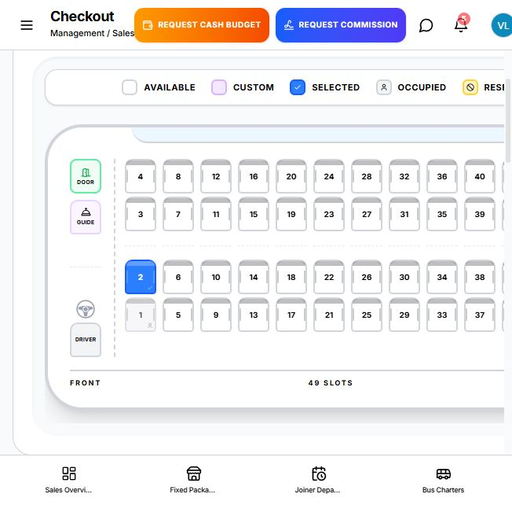

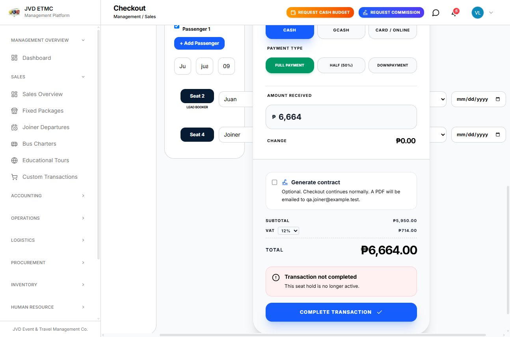

**Impact:** No new Joiner booking, invoice, collection, or customer document can be created.

### P0 — Bus Charter rate and checkout flow is unusable

**Observed**

- The rate-plan library initially displayed zero options.
- `SM Mall of Asia` and a full known address did not resolve reliably.
- Reverse geocoding took roughly 20-40 seconds.
- Clicking visible map locations returned coordinates far from the selected place.
- The UI stayed at `Calculating road route...` or returned `No drivable route was found`.
- Fuel, toll, and rate totals remained zero, so the plan could not be saved and checkout could not begin.
- During the audit the backend also logged `/api/v1/sales/bus-availability` failures caused by querying a nonexistent `invoices.bus_id` column (examples: `ERR-DC6VQY9RAS`, `ERR-6OOJD6VPCT`).

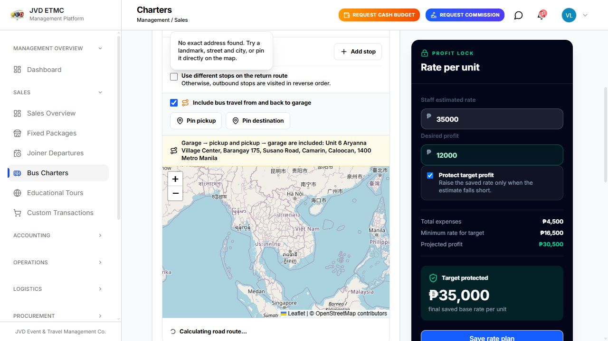

**Impact:** Staff cannot prepare a charter quotation or complete a charter sale.

### P1 — Fixed Package date state blocks checkout

**Observed**

- Package `QA RC Fixed Package 082526` saved successfully.
- Route calculation returned 56.6 km outbound, 55.68 km return, and 112.29 km total.
- Adult/child pricing calculated correctly: `₱1,850 + ₱1,500 = ₱3,350`.
- Fuel summary displayed `44.9 L`, but a detailed field leaked floating-point precision as `44.916000000000004 L`.
- The departure date visually accepted a browser fill but cleared on the next state change.
- The return date was read-only and stayed blank.
- Add-to-order stopped with `Set the tour start and end dates.`; fleet assignment and checkout were unreachable.

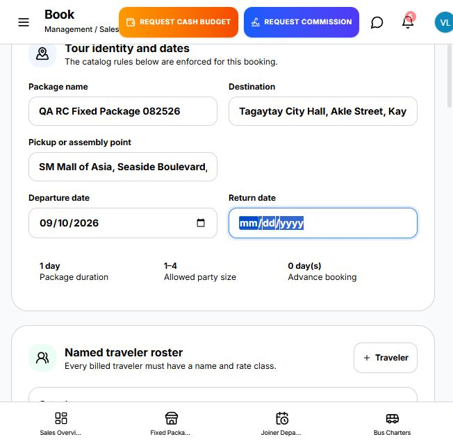

**Important test limitation:** Native date-picker behavior may contribute to the browser-automation reproduction. This remains a release blocker until a staff member can complete the same flow manually in the target production browser and a regression test proves the controlled date values persist.

### P1 — Educational Tour documents fail, but seat reassignment is fixed

**Verified working**

- Package `Browser QA Educational Tour 082526-01`, code `JVD-EDT-BROWSER--2026-003`.
- Booking `EDT-BROWSER-082526-001`, participant `Alpha BrowserQA`.
- Invoice/collection `₱2,400`, balance `₱0`, status `Confirmed`.
- Bus `APA 4526`, driver `Eduardo E. Deblios`, 1/49 seats occupied and 48 free.
- Moving the participant from Seat 1 to Seat 4 now persists after confirmation.
- Public registration remains removed; the tested workflow is desk-operated.

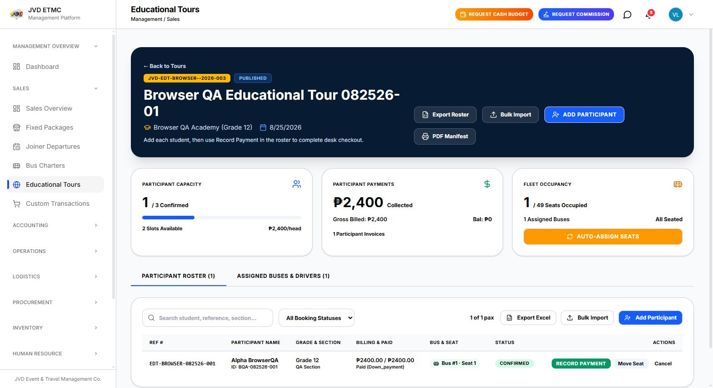

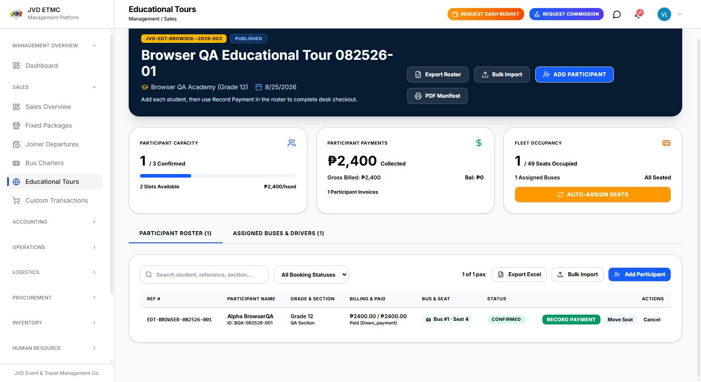

**Remaining defects**

- The seat modal initially says `Selected Seats (1): 1` while Seat 1 is visually occupied and no selected seat is highlighted, which is misleading even though reassignment now works.
- `PDF Manifest` produces no download, new tab, visible success, or error.
- `Export Excel` produces no download or visible result.

### P1 — Custom checkout succeeds, but contract and email automation fail

**Verified working**

- Arrangement `QA RC Custom Arrangement 082626` added to cart.
- Customer price `₱2,500`, supplier cost `₱1,500`, margin `₱1,000`.
- VAT `₱300`; total and amount received `₱2,800`; change `₱0`.
- Checkout eventually generated invoice `INV-PBF05XAH` and order `ORD-082526-001`.
- Accounting recorded the invoice as paid with a `₱0` balance.
- Collection #9 shows `₱2,800` billing, paid, and completed.

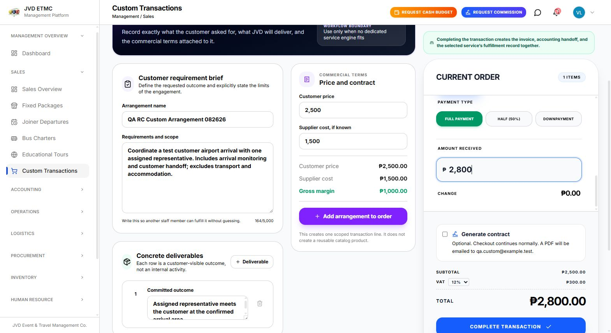

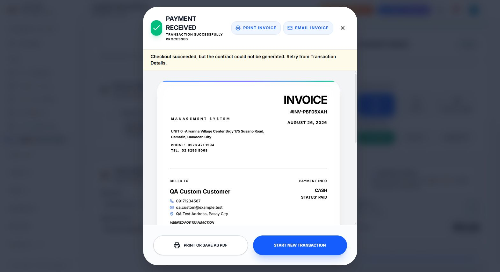

**Defects**

- Checkout took approximately 60-70 seconds with the action disabled and no progress explanation.
- Checkout displayed `Checkout succeeded, but the contract could not be generated.`
- Accounting labels the contract `Issued` and assigns `CTR-2026-0001`; retrying Contract from Transaction Details opens `Service Contract CTR-2026-0001`. The document is recoverable, but the checkout message and persisted state are contradictory.
- `Email Invoice` fails after a long wait with a generic support error. Backend root cause: undefined `Invoice.payments` relationship; error reference `ERR-EM46YBGOPD`.
- The invoice says August 26, 2026, but the posted payment/collection history records August 25, 2026 — a one-day timezone/date inconsistency.

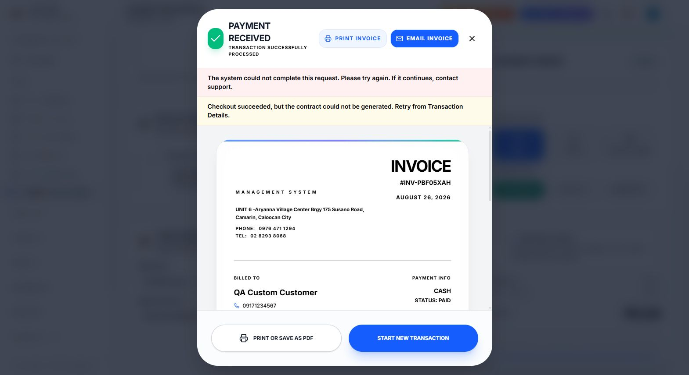

### P2 — Accounting documents open, but feedback is delayed and unclear

**Verified working**

- Accounting lists 14 customer transactions.
- Net collected is `₱35,675`; outstanding is `₱100,225`.
- The new Custom transaction and the paid Educational Tour appear with correct totals and zero balances.
- Custom payment evidence is posted as `PAY-6` for `₱2,800`.
- Invoice opens an `Official Invoice` blob document tab.
- Contract opens `Service Contract CTR-2026-0001`.
- Statement of Account opens a `Statement of Account` blob document tab.

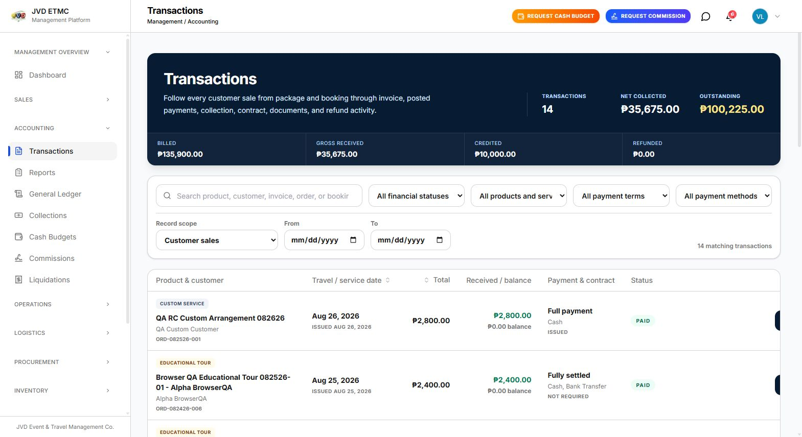

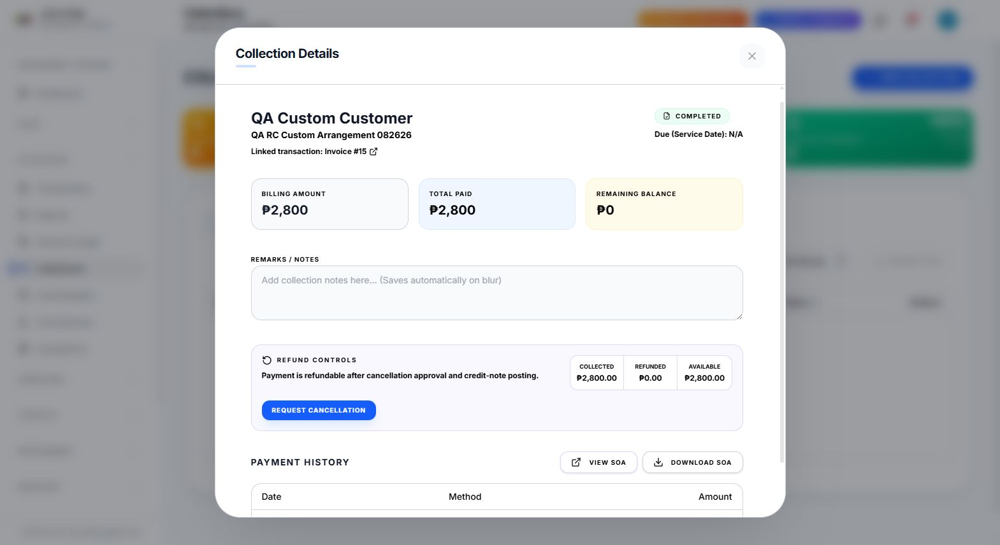

**Remaining defects**

- Document buttons temporarily disable without an in-page progress or success message, and the new tabs can appear after the initial action check.
- The browser opens local blob documents instead of providing a durable document reference visible in the transaction.
- Searching Collections for the exact completed customer returned `No records found` even though the collection was open by ID and marked completed.

### P2 — UI and runtime quality issues

- Joiner checkout total was clipped at the tested narrower viewport.
- Several initial page loads took 12-20 seconds; Custom checkout/document actions took substantially longer.
- The local Laravel server stopped listening once during the audit and had to be restarted. Repeated chat/notification polling also timed out when multiple app tabs were open.
- Route calculation exposes raw floating-point precision in Fixed Packages.
- Document actions lack clear in-page feedback, leaving staff uncertain while generation is still processing.

## Document-generation coverage

| Document/action | Result |
|---|---|
| Custom checkout invoice render | **Pass** — invoice `INV-PBF05XAH` rendered |
| Custom contract generation | **Partial** — checkout warning shown, but retry from Transaction Details opens `CTR-2026-0001` |
| Custom invoice email | **Fail** — backend 500, `ERR-EM46YBGOPD` |
| Accounting Invoice action | **Pass** — opens `Official Invoice` blob tab |
| Accounting Contract action | **Pass** — opens `Service Contract CTR-2026-0001` blob tab |
| Collection View SOA | **Pass** — opens `Statement of Account` blob tab |
| Collection Download SOA | **Pass/unclear** — generated Statement of Account tab observed; no in-page confirmation |
| Educational PDF Manifest | **Fail/silent** |
| Educational Excel export | **Fail/silent** |
| Fixed Package documents | **Not reached** — checkout blocked |
| Joiner documents | **Not reached** — checkout blocked |
| Bus Charter quotation/documents | **Not reached** — rate plan blocked |

## Recommended release gates

Do not promote Sales until all of the following pass in one clean browser run:

- [ ] A newly held Joiner seat survives validation, finalizes exactly once, and releases correctly on expiration/cancel.
- [ ] Fixed Package departure/return dates persist through cart updates and complete fleet assignment, invoice, and payment.
- [ ] Bus Charter address lookup and map pins produce the selected coordinates, a drivable route, and nonzero rate calculations.
- [ ] Educational Manifest PDF and Excel files download with the correct participant, bus, driver, and seat data.
- [ ] Contract status, checkout messaging, and stored/openable document agree at every stage.
- [ ] Invoice email succeeds using the actual posted-payment relation and returns an observable result.
- [ ] Every document action shows progress and confirms which file or tab was generated; failures show an actionable error reference.
- [ ] All sales/accounting timestamps use the configured Asia/Singapore business date consistently.
- [ ] The complete suite passes at desktop and narrower staff workstation widths without clipped totals or actions.

## QA data created or used

- Fixed Package: `QA RC Fixed Package 082526`
- Joiner product: `QA RC Joiner 082526`
- Joiner departure used: `JTSW-2027-06-18`
- Educational package: `Browser QA Educational Tour 082526-01`
- Educational booking: `EDT-BROWSER-082526-001`
- Custom arrangement: `QA RC Custom Arrangement 082626`
- Custom order/invoice: `ORD-082526-001` / `INV-PBF05XAH`
- Custom collection/payment: Collection #9 / `PAY-6`

## Final assessment

The package-based, per-head Educational Tour billing and seat-allocation model is materially working, including the corrected seat reassignment. The overall Sales release is still blocked by Joiner hold validation, Fixed Package date persistence, Charter route pricing, and cross-module document automation. Finance posting is partially reliable, but the failed-contract/Issued-state mismatch and one-day payment-date mismatch must be resolved before release.
