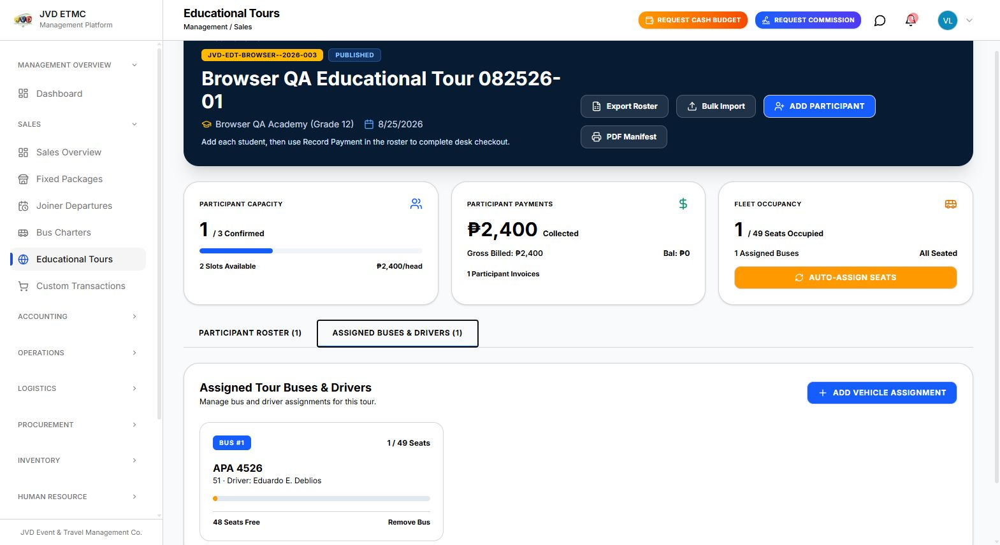
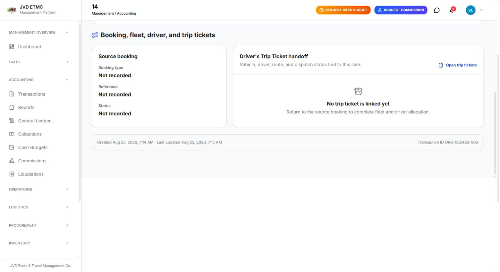
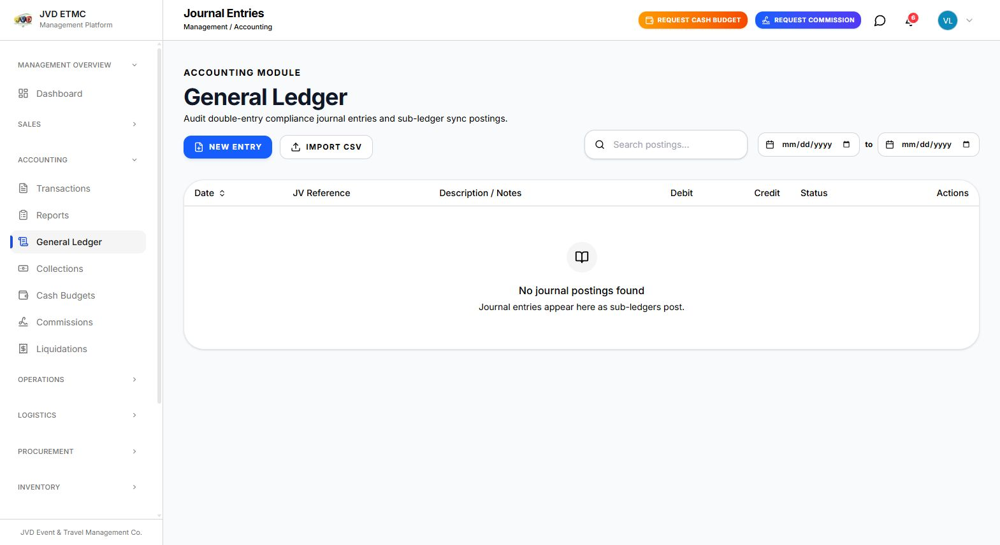

# Sales → Accounting → Logistics → Driver Handoff Audit

**Environment:** Local test site  
**Audit date:** August 26, 2026 (Asia/Singapore)  
**Source sale:** `Browser QA Educational Tour 082526-01`  
**Participant:** `Alpha BrowserQA`  
**Booking:** `EDT-BROWSER-082526-001`  
**Invoice / order:** `INV-SCHOOL-082426-001` / `ORD-082426-006`

## Current verdict

**The end-to-end operational handoff is broken.** Sales correctly holds the paid participant, assigned seat, bus, and driver, and Accounting correctly holds the invoice and collection. The transaction loses its booking, traveler, vehicle, and driver relationships before Logistics. No Educational Tour trip ticket is created, so there is nothing valid to dispatch to the Driver workflow.

Driver-role verification is pending because the original browser session expired and the recovered test account is blocked by a mandatory password-change screen. No credentials were modified during QA.

## Connected workflow results

| Stage | Expected handoff | Observed | Result |
|---|---|---|---|
| Sales package | Participant, individual booking, invoice, seat, bus, driver | All present and reconciled | **Pass** |
| Accounting transaction | Preserve booking reference and traveler | Invoice/payment present, but booking is `Not recorded` and traveler count is 0 | **Fail** |
| Accounting collection | Preserve posted payment and balance | ₱2,400 received, ₱0 balance, two cash payments | **Pass** |
| General Ledger | Post balanced sub-ledger journal entries | No journal postings exist | **Fail** |
| Accounting Reports | Include paid sale in revenue/transaction reports | Reports show ₱0 revenue and 0 transactions | **Fail** |
| Logistics trip ticket | Create/link ticket from assigned bus and driver | Accounting says no linked ticket; no Educational ticket exists | **Fail** |
| Fleet registry | Resolve APA 4526 and Eduardo assignment | Sales assignment exists; downstream validation is incomplete | **Blocked by expired-session recovery state** |
| Driver schedule | Show assigned trip for Eduardo | No valid trip ticket exists to dispatch | **Blocked upstream** |
| Driver vehicle/commission/completion | Receive fleet, allowance, commission, and completion state | Not reachable without a dispatched trip ticket and Driver login | **Pending** |

## Evidence and discrepancies

### 1. Sales source is complete

- Package code `JVD-EDT-BROWSER--2026-003`.
- Participant status `confirmed`.
- ₱2,400 billed and ₱2,400 collected.
- Seat `Bus #1 · Seat 4`.
- Vehicle `APA 4526`, 1/49 occupied.
- Driver `Eduardo E. Deblios`.

### 2. Accounting loses the operational relationships

Accounting transaction #14 correctly shows:

- Total / received / net collected: ₱2,400.
- Balance: ₱0.
- Invoice `INV-SCHOOL-082426-001`.
- Payments `PAY-4` (₱800) and `PAY-5` (₱1,600).

But the same transaction shows:

- `No typed booking reference`.
- `0 travelers · Not recorded`.
- `No named passenger roster is linked yet`.
- Booking type, reference, and status all `Not recorded`.
- `No trip ticket is linked yet`.

### 3. Payment data is financially complete but date-shifted

- Collection #8 is completed for ₱2,400 with ₱0 balance.
- Both posted payments use Cash.
- Transaction summary displays `Cash, Bank Transfer`, which does not match the posted payment methods.
- Invoice and service date are August 25, but both payments display August 24, indicating the same UTC/business-date shift seen in the Custom sale.

### 4. General Ledger is empty

The General Ledger states that journal entries appear as sub-ledgers post, but it contains no postings despite 14 customer transactions and ₱35,675 net collected in the Transactions ledger.

### 5. Accounting Reports do not reconcile

The Reports page shows:

- Total revenue: ₱0.
- Total expenses: ₱0.
- Total transactions: 0.
- No transaction records.

This contradicts the Transactions and Collections pages.

### 6. Trip-ticket persistence confirmation

Supporting read-only database verification found one trip ticket in the entire local database: `DTT-2026-0001`, a draft Joiner ticket with no bus, plate, or driver. Eduardo has zero trip tickets, and no ticket exists for the tested Educational Tour.

## Required repair order

1. Persist a typed Educational booking/source reference on the invoice/order.
2. Link the participant booking to Accounting travelers/passengers.
3. Carry the Educational bus-assignment ID, bus ID, and driver ID into the transaction handoff.
4. Create one trip ticket per assigned bus after the package meets the intended dispatch condition.
5. Link each trip ticket back to the order, invoice, package, assignment, bus, and driver.
6. Post invoice/payment journal entries and reconcile Accounting Reports to the Transactions ledger.
7. Normalize timestamps to the Asia/Singapore business date.
8. Verify the assigned Driver can see the trip, vehicle, passenger/manifest data, allowances, commission, and completion workflow.

## Pending browser check

The next QA step requires an authenticated Driver session for Eduardo E. Deblios. Once that session is available, test Scheduled Trips, My Fleet, My Commissions, trip acceptance/start/completion controls, and the return status in Logistics and Accounting.
